# README.md

## **프로젝트 개요**

비대면 화상 중고거래 플랫폼 **봐봐요**는 실시간 화상 채팅을 통한 거래 검증으로 **택배거래 사기 문제를 예방**하고, 안전하고 신뢰성 있는 중고거래 환경을 제공합니다.

- **개발 기간** : 2025.07.07 ~ 2025.08.18 (7주)
- **플랫폼** : Web
- **개발 인원** : 6명 (프론트엔드 2명, 백엔드 4명)

## 팀원 구성

|  |  |  |  |  |  |
| --- | --- | --- | --- | --- | --- |
| 장종원(PM) | 조우영(FE) | 전소슬(FE) | 이재원(BE) | 배준수(BE) | 원윤서(BE) |
| - AI 챗봇, 검색엔진 - WebRTC - 인프라 구축 | - 소켓통신, WebRTC - 결제연동 | - 사용자 인증 및 인가 - 개인화 서비스 API 연동  | -인증/보안 - OAuth 연동 - User API 개발 | -상품 도메인 -검색엔진 -S3 관리 - 알림(SSE)  | - 채팅(Web Socket) - 화면 디자인 - 인프라 구축 |

## 시스템 아키텍처
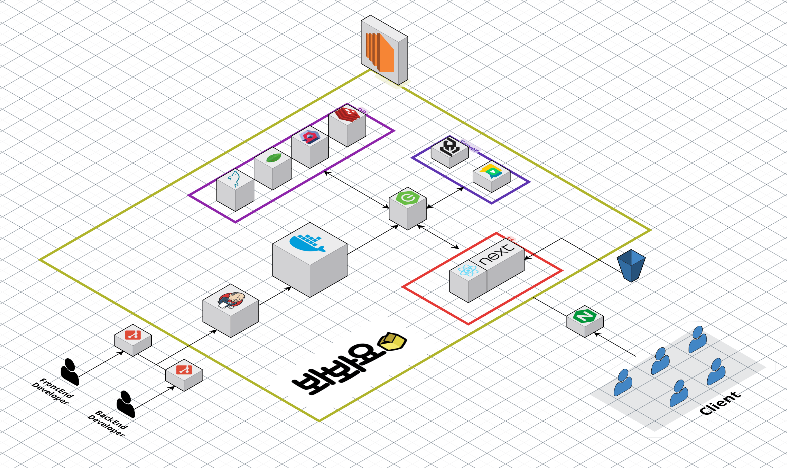

## 기술 스택

### FE

 

  

 
  

- **Language |** JavaScript, TypeScript 5.5.3
- **Runtime Environment |** Node.js v22.17.1
- **Framework |** Next.js 14.2.30 (React 18.2.0), Tailwind CSS 4
- **Library |** Zustand 5.0.6, Axios 1.11.0, OpenVidu Browser 2.29.0, Socket.io 4.8.1, STOMP.js 7.1.1, SockJs 1.6.1, Event Source Polyfill 1.0.31, TossPayments SDK 2.3.5, Swiper 11.2.10, React Slick 0.30.3, React Calendar 6.0.0, React Date Picker 12.0.1, Lucide React 0.539.0
- **IDE |** Visual Studio Code 1.99.3, Cursor 1.4.5

### BE

 

 

 

- **Language |** Java 17 (OpenJDK 17.0.16)
- **Framework |** Spring Boot 3.5.3

- **Library |** Spring Security, Oauth2 Client, JWT, Spring Web, Srping WebSocket, Spring WebFlux, OpenVidu, Spring Data JPA, Spring Data Redis, QueryDSL 5.0.0, Spring Cloud AWS 2.2.6, SpringDoc OpenAPI 2.8.8, Lombok, Apache Lucene, Lucene Analysis Nori, Open Korean Text 2.3.1
- **Database |** MySQL 8.0.18, Redis 7.2,  Qdrant 1.15.1
- **IDE |** IntelliJ IDEA 2025.1.3 (Ultimate Edition)
- **Build Tool |** Gradle 8.14.3

### DevOps

- **AMI |** Ubuntu 22.04.4 LTS
- **Web Server**: Nginx 1.18.0 (Ubuntu)
- **Docker |** 28.3.2
- **Docker Compose |** v2.38.2
- **CI/CD |** Jenkins 2.516.1

### Collaboration

 

 

## 기능 구성

### 메인
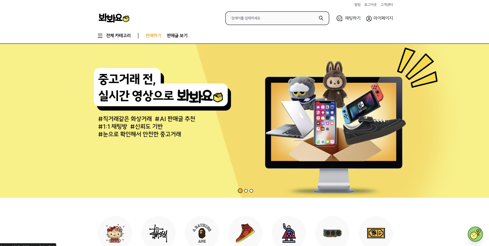

### 판매글 보기
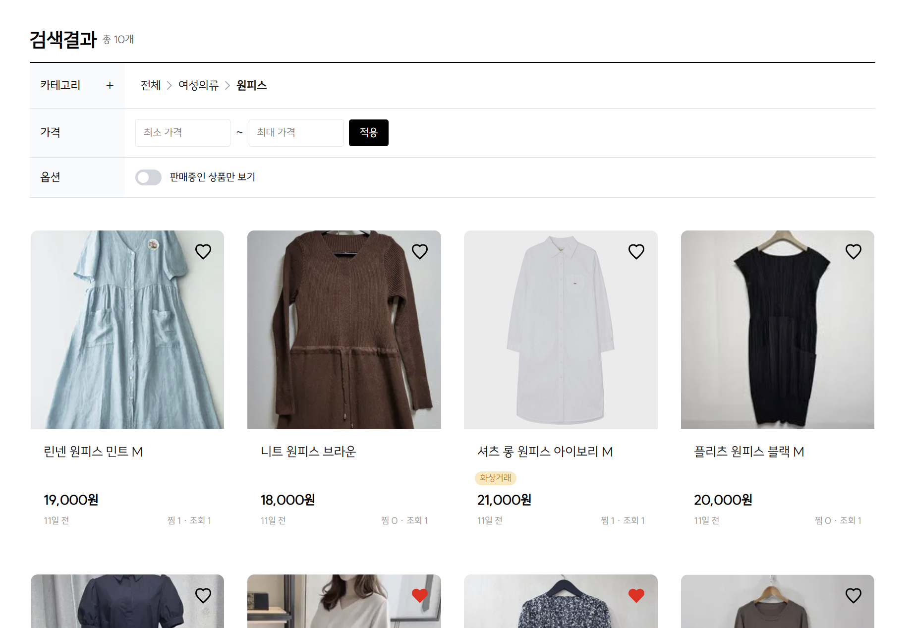

### 판매글 작성
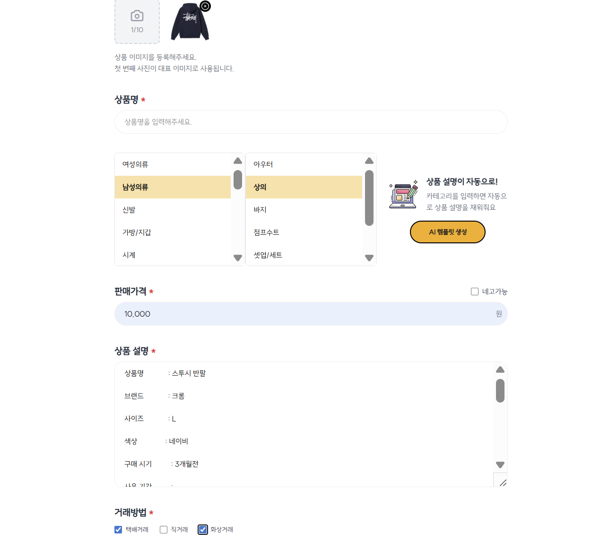

### 채팅하기
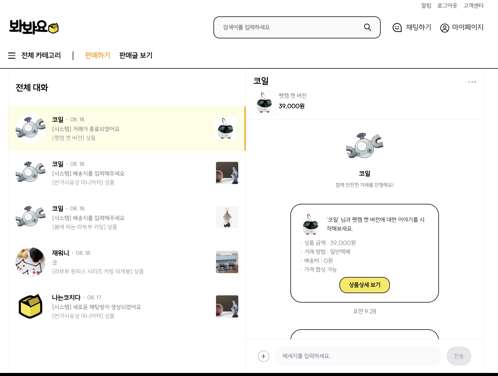

### 화상거래
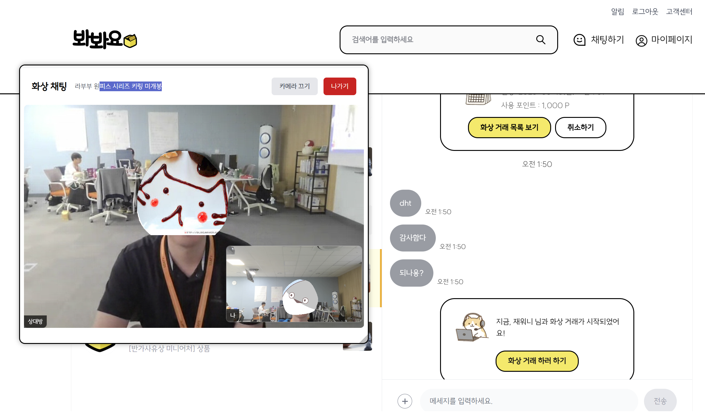

### 리뷰 작성
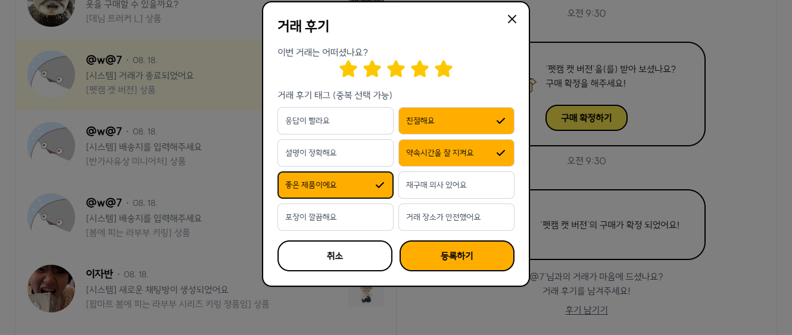

### 내정보
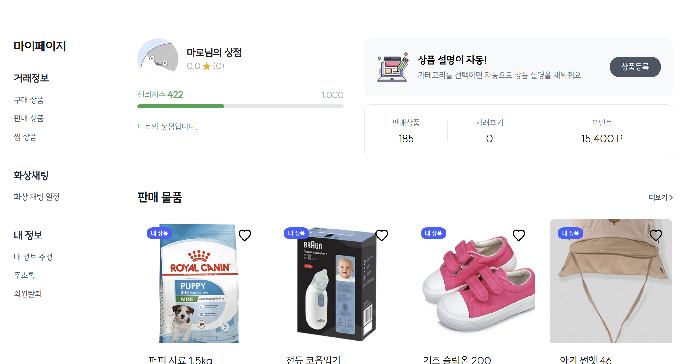

### 구매이력 조회
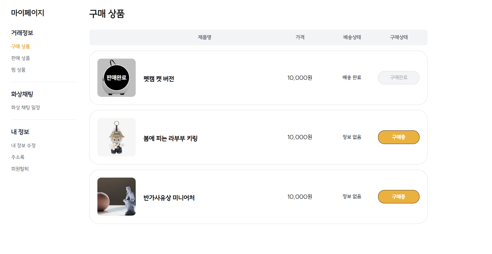

## 프로젝트 산출물

### 화면설계서

[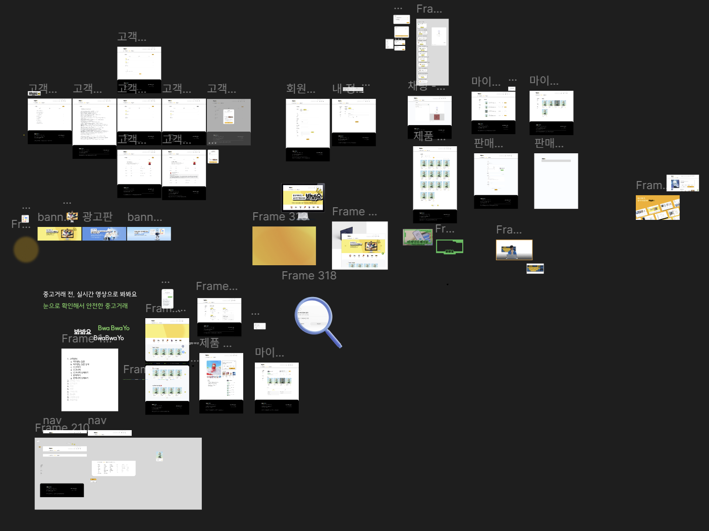](https://www.figma.com/design/1TaIBDaoszdC5N1xcZBrlZ/%ED%8C%80-%ED%94%84%EB%A1%9C%ED%95%84-%EB%94%94%EC%9E%90%EC%9D%B8?node-id=0-1&m=dev&t=wCETQbmlYcp8vyBa-1)

### ERD

[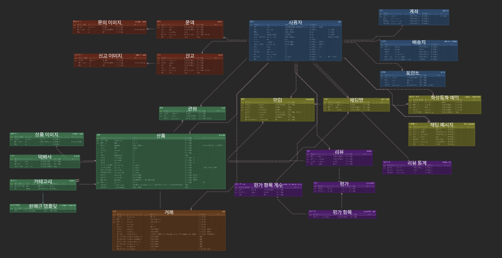](https://www.erdcloud.com/d/hDa5k3BnFy7xr85oo)

### API 명세서
[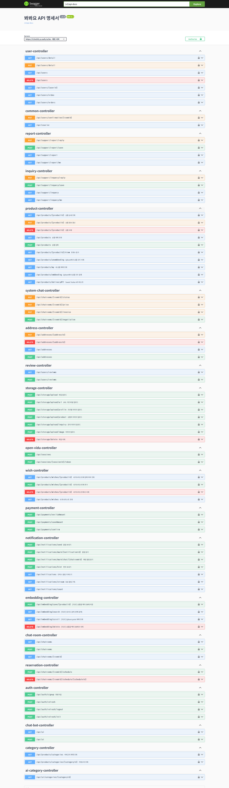](https://hip-water-dfc.notion.site/API-23332874d9b180a9be1bcd4f3ba71315)
