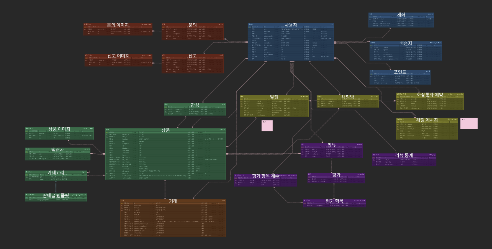

# 봐봐요 - 포팅 매뉴얼

# 1. Gitlab 소스 클론 이후 빌드 및 배포 방법

## 1.1 개발 환경 및 버전 정보

### 개발 도구 (IDE)

- **VS Code**: 1.99.3
- **IntelliJ IDEA**: 2025.1.3

### 프론트엔드 (Frontend)

- **프레임워크**: Next.js 14.2.30
- **언어**: TypeScript 5.5.3
- **런타임**: Node.js 20.11.1 LTS (Hydrogen)
- **패키지 매니저**: NPM 10.9.2
- **스타일링**: Tailwind CSS 4.x
- **상태 관리**: Zustand 5.0.6
- **UI 라이브러리**: React 18.2.0
- **실시간 통신**:
    - Socket.io Client 4.8.1
    - EventSource Polyfill 1.0.31
- **개발 도구**: ESLint 9.x

### 백엔드 (Backend)

- **프레임워크**: Spring Boot 3.5.3
- **언어**: Java 17 (OpenJDK 17.0.16)
- **빌드 도구**: Gradle 8.14.3
- **웹 및 보안**
    - Spring Web
    - Spring Security
    - OAuth2 Client
- **데이터베이스**
    - Spring Data JPA
    - QueryDSL 5.0.0
- **실시간 통신**:
    - OpenVidu: 2.29.0
    - Kurento: 7.0.1
    - WebSocket + STOMP
- **텍스트 전처리**:
    - Lucene Nori
    - Open Korean Text 2.3.1
- **개발 도구**:
    - Lombok
    - Spring DevTools
    - SpringDoc OpenAPI

### 데이터베이스 (Database)

- **MySQL**: 8.0.18
- **Redis**: 7.2
- **MongoDB**: 7.x
- **Qdrant**: 1.15.1

### 서버 환경

- **OS**: Ubuntu 22.04.4 LTS
- **Web Server**: Nginx 1.18.0 (Ubuntu)
- **Container**:
    - Docker 28.3.2
    - Docker Compose v2.38.2
- **Jenkins**: 2.516.1

### UI

- **Figma**

### 형상/이슈관리

- **Gitlab**
- **Jira**

## 1.2 EC2 포트 정보

| 서비스 | 포트 | 설명 |
| --- | --- | --- |
| **프론트엔드** | 3000 | Next.js 애플리케이션 |
| **백엔드** | 8081 | Spring Boot API 서버 |
| **MySQL** | 3306 | 데이터베이스 |
| **Redis** | 6379 | 캐시 및 세션 저장소 |
| **Qdrant** | 6333 | 벡터 데이터베이스 |
| **OpenVidu** | 8443 | 화상 통화 서비스 |
| **Jenkins** | 8080 | CI/CD 파이프라인 |
| **Nginx** | 80, 443 | HTTP/HTTPS 프록시 서버 |

## 1.3 빌드 과정에서 사용되는 환경 변수

프로젝트 빌드 및 실행에 필요한 주요 환경 변수들입니다.

### 프론트엔드(Next.js) 환경 변수

**기본 환경 변수:**

```bash
# API 서버 URL
NEXT_PUBLIC_API_URL=https://i13e202.p.ssafy.io/be/api

# Toss Payments 클라이언트 키
NEXT_PUBLIC_TOSS_CLIENT_KEY=${TOSS_CLIENT_KEY}

# Kakao OAuth 클라이언트 ID
NEXT_PUBLIC_KAKAO_CLIENT_ID=${KAKAO_CLIENT_ID}
```

**환경별 설정:**

1. **개발 환경 (.env.local)**
    
    ```bash
    NEXT_PUBLIC_PUBLIC_URL=
    ```
    
2. **프로덕션 환경 (.env.production)**
    
    ```bash
    NEXT_PUBLIC_PUBLIC_URL=/fe
    ```
    

### 백엔드(Spring) 환경 변수

```bash
# .env

# --- Server ---
SERVER_PORT

# --- DB (MySQL) ---
MYSQL_URL
MYSQL_USERNAME
MYSQL_PASSWORD

# --- MongoDB ---
MONGODB_URI
MONGODB_DATABASE

# --- Redis ---
REDIS_HOST
REDIS_PORT
REDIS_PASSWORD
REDIS_TIMEOUT

# --- Kakao OAuth2 ---
KAKAO_CLIENT_ID
KAKAO_CLIENT_SECRET
KAKAO_REDIRECT_URI

# --- JWT ---
JWT_SECRET
JWT_ACCESS_EXP_MINUTES
JWT_REFRESH_EXP_MINUTES
JWT_HEADER
JWT_TYPE
JWT_TYPE_ACCESS
JWT_TYPE_REFRESH
JWT_AES_KEY
JWT_AES_IV
JWT_REFRESH_REISSUE_THRESHOLD_DAYS

# --- OpenAI ---
OPENAI_SECRET_KEY
OPENAI_CHAT_URL
OPENAI_CHAT_MODEL
OPENAI_EMBED_URL
OPENAI_EMBED_MODEL

# --- AWS S3 ---
AWS_ACCESS_KEY_ID
AWS_SECRET_ACCESS_KEY
AWS_REGION
S3_BUCKET
S3_MULTIPART_THRESHOLD
S3_PART_SIZE

# --- Storage ---
STORAGE_TEMP_PATH
STORAGE_PRODUCT_IMAGE_PATH
STORAGE_PROFILE_IMAGE_PATH

# --- Qdrant ---
QDRANT_BASE_URL
QDRANT_COLLECTION
QDRANT_VECTOR_SIZE

# --- OpenVidu ---
OPENVIDU_URL
OPENVIDU_SECRET

# --- Toss Payments ---
TOSS_SECRET_KEY
TOSS_CONFIRM_URL

# --- Sweet Tracker ---
SWEET_TRACKER_API_KEY

# --- Logging ---
LOGGING_LEVEL
```

```yaml
# application.yml
server:
  port: ${SERVER_PORT:8081}

spring:
  application:
    name: app

  datasource:
    url: ${MYSQL_URL}
    username: ${MYSQL_USERNAME}
    password: ${MYSQL_PASSWORD}
    driver-class-name: com.mysql.cj.jdbc.Driver

  jpa:
    hibernate:
      ddl-auto: update
    show-sql: true

  data:
    mongodb:
      uri: ${MONGODB_URI}
      database: ${MONGODB_DATABASE}
    redis:
      host: ${REDIS_HOST}
      port: ${REDIS_PORT}
      password: ${REDIS_PASSWORD}
      timeout: ${REDIS_TIMEOUT:6000}

  security:
    oauth2:
      client:
        registration:
          kakao:
            client-name: kakao
            client-id: ${KAKAO_CLIENT_ID}
            client-secret: ${KAKAO_CLIENT_SECRET:}
            redirect-uri: ${KAKAO_REDIRECT_URI}
            client-authentication-method: client_secret_post
            authorization-grant-type: authorization_code
            scope: profile_image, account_email
        provider:
          kakao:
            authorization-uri: https://kauth.kakao.com/oauth/authorize
            token-uri: https://kauth.kakao.com/oauth/token
            user-info-uri: https://kapi.kakao.com/v2/user/me
            user-name-attribute: id

  servlet:
    multipart:
      max-file-size: 2GB
      max-request-size: 2GB

jwt:
  secret: ${JWT_SECRET}
  access-exp-minutes: ${JWT_ACCESS_EXP_MINUTES}
  refresh-exp-minutes: ${JWT_REFRESH_EXP_MINUTES}
  header: ${JWT_HEADER}
  type: ${JWT_TYPE}
  type-access: ${JWT_TYPE_ACCESS}
  type-refresh: ${JWT_TYPE_REFRESH}
  aes-secret-key: ${JWT_AES_KEY}
  aes-iv: ${JWT_AES_IV}
  refresh-reissue-threshold-days: ${JWT_REFRESH_REISSUE_THRESHOLD_DAYS}

openai:
  secret-key: ${OPENAI_SECRET_KEY}
  chat-url: ${OPENAI_CHAT_URL}
  chat-model: ${OPENAI_CHAT_MODEL}
  embedding-url: ${OPENAI_EMBED_URL}
  embedding-model: ${OPENAI_EMBED_MODEL}

cloud:
  aws:
    credentials:
      accessKey: ${AWS_ACCESS_KEY_ID}
      secretKey: ${AWS_SECRET_ACCESS_KEY}
    region:
      static: ${AWS_REGION}
    s3:
      bucket: ${S3_BUCKET}
    stack:
      auto: false
    multipart-upload:
      threshold: ${S3_MULTIPART_THRESHOLD}
      part-size: ${S3_PART_SIZE}

storage:
  path:
    temp: ${STORAGE_TEMP_PATH}
    productImage: ${STORAGE_PRODUCT_IMAGE_PATH}
    profileImage: ${STORAGE_PROFILE_IMAGE_PATH}

qdrant:
  base-url: ${QDRANT_BASE_URL}
  collection-name: ${QDRANT_COLLECTION}
  vector-size: ${QDRANT_VECTOR_SIZE}

openvidu:
  url: ${OPENVIDU_URL}
  secret: ${OPENVIDU_SECRET}

toss:
  key:
    secret-key: ${TOSS_SECRET_KEY}
  url:
    confirm: ${TOSS_CONFIRM_URL}

sweet-tracker:
  api-key: ${SWEET_TRACKER_API_KEY}

logging:
  level:
    com.bwabwayo.app: ${LOGGING_LEVEL}
```

## 1.4 빌드 및 실행 방법

프로젝트를 빌드하고 실행하는 방법을 단계별로 설명합니다.

---

### 1.4.1 프론트엔드 빌드 및 실행

**✅ 1) 의존성 설치**

```bash
cd bwabwayo
npm install

```

**✅ 2) 환경 변수 설정**

`.env.local` 파일을 생성하고 필요한 환경 변수를 설정합니다:

```bash
# .env.local
NEXT_PUBLIC_API_URL=https://i13e202.p.ssafy.io/be/api
NEXT_PUBLIC_TOSS_CLIENT_KEY=your_toss_client_key
NEXT_PUBLIC_KAKAO_CLIENT_ID=your_kakao_client_id

```

**✅ 3) 개발 서버 실행**

```bash
npm run dev

```

- 개발 서버: [http://localhost:3000](http://localhost:3000/)

**✅ 4) 프로덕션 빌드**

```bash
npm run build
npm start

```

---

### 1.4.2 백엔드 빌드 및 실행

**✅ 1) Java 및 Gradle 설치 확인**

```bash
java -version   # Java 17 이상 필요
gradle -version # Gradle 8.14.3 이상 필요

```

**✅ 2) 환경 변수 설정**

`.env` 파일을 생성하고 필요한 환경 변수를 설정합니다:

```bash
# .env
SERVER_PORT=8081
MYSQL_URL=jdbc:mysql://localhost:3306/bwabwayo
MYSQL_USERNAME=your_username
MYSQL_PASSWORD=your_password
# ... 기타 필요한 환경 변수들

```

**✅ 3) 프로젝트 빌드**

```bash
cd bwabwayo
gradle clean build

```

**✅ 4) 애플리케이션 실행**

```bash
# JAR 파일 실행
java -jar build/libs/bwabwayo-0.0.1-SNAPSHOT.jar

# Gradle 실행
gradle bootRun

```

---

### 1.4.3 Docker를 이용한 실행

**✅ 1) Docker Compose 실행**

```bash
docker-compose up -d

```

**✅ 2) 개별 서비스 실행**

- **MySQL (포트 3306)**

```bash
docker run -d \
  --name mysql-container \
  -e MYSQL_ROOT_PASSWORD=your_password \
  -e MYSQL_DATABASE=bwabwayo \
  -p 3306:3306 \
  mysql:8.0

```

- **Redis (포트 6379)**

```bash
docker run -d \
  --name redis-chat \
  -p 6379:6379 \
  redis:7.2

```

- **Qdrant (포트 6333, 6334)**

```bash
docker run -d \
  --name qdrant \
  -p 6333:6333 \
  -p 6334:6334 \
  -v $(pwd)/qdrant_storage:/qdrant/storage \
  qdrant/qdrant

```

- **OpenVidu (포트 8443, 3478)**
    
    (Server, KMS, Proxy, Coturn)
    

```bash
docker run -d \
  --name openvidu-openvidu-server-1 \
  -p 8443:8443 \
  -e OPENVIDU_SECRET=your_secret \
  openvidu/openvidu-server:2.29.0

```

```bash
docker run -d --name openvidu-kms-1 kurento/kurento-media-server:7.0.1
docker run -d --name openvidu-nginx-1 openvidu/openvidu-proxy:2.29.0
docker run -d \
  --name openvidu-coturn-1 \
  -p 3478:3478/tcp \
  -p 3478:3478/udp \
  openvidu/openvidu-coturn:2.29.0

```

- **Jenkins (포트 8080)**

```bash
docker run -d \
  --name jenkins \
  -p 8080:8080 \
  -p 50000:50000 \
  -v jenkins_home:/var/jenkins_home \
  jenkins/jenkins:lts

```

**✅ 3) 컨테이너 관리**

```bash
# 실행 중인 컨테이너 확인
docker ps

# 로그 확인
docker logs [CONTAINER_NAME]

# 상태 확인
docker stats

```

---

### 1.4.4 전체 시스템 실행 순서

1. **데이터베이스 서비스 시작**
    - MySQL, Redis, MongoDB, Qdrant
2. **백엔드 서비스 시작**
    - Spring Boot (포트 8081)
3. **프론트엔드 서비스 시작**
    - Next.js (포트 3000)
4. **외부 서비스 확인**
    - OpenVidu, AWS S3 등

---

### 1.4.5 빌드 시 주의사항

- Node.js: **20.11.1 LTS 이상**
- Java: **OpenJDK 17 이상**
- 메모리: **최소 8GB RAM**
- 포트 충돌: **3000, 8081, 3306, 6379, 6333, 8443**
- 환경 변수 확인 필수

---

### 1.4.6 문제 해결

### ⚡ 일반적인 빌드 오류

```bash
# 캐시 정리
npm cache clean --force
gradle clean

# node_modules 재설치
rm -rf node_modules package-lock.json
npm install

# Gradle 캐시 새로고침
gradle clean build --refresh-dependencies

```

### ⚡ 포트 충돌 해결

```bash
# 포트 점유 확인
netstat -tulpn | grep :3000
netstat -tulpn | grep :8081

# 프로세스 종료
kill -9 [PID]

```

---

👉 이제 이 마크다운을 그대로 노션에 붙여넣으면 **계층 구조가 깔끔하게 적용**될 거예요.

## **1.5 주요 계정 및 프로퍼티 (ERD)**

프로젝트의 데이터베이스 구조와 주요 엔티티 관계를 설명합니다.

[](https://www.erdcloud.com/d/hDa5k3BnFy7xr85oo)

이미지 클릭시 ERD로 이동합니다.

---

# 2. 외부 서비스 정보

프로젝트에서 활용된 외부 서비스의 가입 및 활용에 필요한 정보입니다.

## 2.1 AWS S3

**용도**: 상품 이미지, 프로필 이미지 등 정적 파일 저장

### 가입 및 설정 방법

1. **AWS 계정 생성**: [https://aws.amazon.com/ko/](https://aws.amazon.com/ko/)
2. **IAM 사용자 생성**:
    - IAM → Users → Create User
    - Username: `bwabwayo-developer`
    - Access type: Programmatic access
3. **권한 설정**: `AmazonS3FullAccess` 정책 연결
4. **S3 버킷 생성**:
    - Bucket name: `bwabwayo-general-bucket`
    - Region: `ap-northeast-2` (서울)

### 프로젝트 연동 정보

```yaml
cloud:
  aws:
    credentials:
      accessKey: [YOUR_ACCESS_KEY]
      secretKey: [YOUR_SECRET_KEY]
    region:
      static: ap-northeast-2
    s3:
      bucket: bwabwayo-general-bucket
    multipart-upload:
      threshold: 10485760 # 10MB
      part-size: 8388608 # 8MB
```

## 2.2 Kakao OAuth

**용도**: 소셜 로그인 인증

### 가입 및 설정 방법

1. **Kakao Developers**: [https://developers.kakao.com/](https://developers.kakao.com/)
2. **애플리케이션 생성**:
    - App name: `봐봐요`
    - Company name: `SSAFY`
3. **플랫폼 설정**:
    - Web 플랫폼 추가
    - Site domain: `[YOUR_DOMAIN]`
4. **카카오 로그인 활성화**:
    - Redirect URI: `[YOUR_REDIRECT_URL]`
    - Scope: `profile_image`, `account_email`

### 프로젝트 연동 정보

```yaml
spring:
  security:
    oauth2:
      client:
        registration:
          kakao:
            client-id: [YOUR_CLIENT_ID]
            redirect-uri: [YOUR_REDIRECT_URL]
            client-authentication-method: client_secret_post
            authorization-grant-type: authorization_code
            scope: profile_image, account_email
        provider:
          kakao:
            authorization_uri: https://kauth.kakao.com/oauth/authorize
            token_uri: https://kauth.kakao.com/oauth/token
            user-info-uri: https://kapi.kakao.com/v2/user/me
            user_name_attribute: id
```

## 2.3 Toss Payments

**용도**: 결제 시스템

### 가입 및 설정 방법

1. **Toss Payments**: [https://developers.tosspayments.com/](https://developers.tosspayments.com/)
2. **결제 서비스 신청** (필요 시)
3. **API 키 발급**:
    - 내 개발정보 → API 키 → API 개별 연동 키
    - 테스트/실제 환경 키 발급

### 프로젝트 연동 정보

### 프론트엔드 (Next.js)

```jsx
// components/chat/modals/tossPay/PaymentCheckout.tsx
const clientKey = [YOUR_CLIENT_KEY];
```

### 백엔드 (Spring Boot)

```yaml
# application.yml
toss:
  key:
    secret-key: [YOUR_SECRET_KEY]
```

**주의사항**:

- 테스트 환경: `test_ck_`로 시작하는 키 사용
- 실제 운영 시: `live_ck_`로 시작하는 키로 변경 필요

## 2.4 SweetTracker (배송 조회)

**용도**: 배송 조회 서비스

### 가입 및 설정 방법

1. [**SweetTracker**](https://tracking.sweettracker.co.kr/) 접속
2. **회원 가입 및 로그인**
3. **API 키 발급**:
    - KEY 목록 → 이용권 구매 → 키 발급

### 프로젝트 연동 정보

```yaml
# application.yml
sweet-tracker:
  api-key: [YOUR_API_KEY]
```

## 2.5 OpenAI API

**용도**: AI 상품 설명 생성, 벡터 임베딩

### 가입 및 설정 방법

1. [**OpenAI**](https://platform.openai.com/) 접속
2. **계정 생성 및 로그인**
3. **API 키 발급**:
    - API Keys → Create new secret key
4. **크레딧 충전** (유료 서비스)

### 프로젝트 연동 정보

```yaml
# application.yml
openai:
  secret-key: [YOUR_API_KEY]
  chat-url: https://api.openai.com/v1/chat/completions
  embedding-url: https://api.openai.com/v1/embeddings
```

**사용 모델**:

- Chat: `gpt-4.1-nano`
- Embedding: `text-embedding-3-large`

## 2.6 OpenVidu

**용도**: 실시간 화상 채팅

### 가입 및 설정 방법

1. [**OpenVidu**](https://openvidu.io/) 접속
2. **Self-hosted 설치**:
    
    ```bash
    # Docker로 설치
    docker run -p 4443:4443 --rm -e OPENVIDU_SECRET=YOUR_SECRET openvidu/openvidu-dev:2.29.0
    ```
    

### 프로젝트 연동 정보

```yaml
# application.yml
openvidu:
  url: https://[YOUR_DOMAIN]:8443
  secret: [YOUR_SECRET]
```

## 2.7 Qdrant (Vector Database)

**용도**: 벡터 데이터베이스 (유사어 검색 기능)

### 가입 및 설정 방법

1. **Self-hosted 설치**:

```bash
# Docker로 설치
docker run -p 6333:6333 -p 6334:6334 \
  -v $(pwd)/qdrant_storage:/qdrant/storage \
  qdrant/qdrant:1.15.1
```

### 프로젝트 연동 정보

### 백엔드 (Spring Boot)

```yaml
# application.yml
qdrant:
  base-url: "https://[YOUR_DOMAIN]/qdrant"
  collection-name: "product-embeddings"
  vector-size: 3072
```

# 3. DB 덤프 파일

## **MySQL**

- `bwabwayo-dump.sql`
    - 스키마 및 초기 데이터 포함

# 4. 시연 시나리오

구매자 입장 시연 시나리오:

1. **상품 탐색**
    - "아 뭐 살 거 없나?" → 메인 페이지 구경
    - 검색창에 오타 입력 → 오타 교정 및 유사어 검색 지원
    - 검색 결과가 너무 많음 → 챗봇 호출
2. **AI 챗봇 활용**
    - 모호한 설명 입력 (예: "가볍고 게임 잘 돌아갈만한 노트북")
    - 챗봇이 특징 기반으로 상품 추천
3. **상품 상세 & 상점 탐색**
    - 추천 상품 클릭 → 판매글 접속
    - 판매자와 채팅 시작 ("안녕하세요 삽니다~")
    - 유사한 다른 판매글 확인 → 상점 방문 → 추가 상품 확인
4. **알림 & 재접속**
    - 알림 수신 확인 → 다시 채팅방 재접속
5. **화상 채팅 예약 및 진행**
    - 구매자가 화상 채팅 예약
    - 판매자가 물건을 실물로 보여줌
    - 구매자 확인 후 "오케이, 거래하시죠"
6. **거래 진행**
    - 판매자가 거래 시작 → 최종 가격 설정
    - 구매자가 결제 선택 (토스, 카카오페이, 문화상품권)
    - 배송지 선택 (구매자)
    - 운송장 번호 입력 (판매자)
7. **거래 마무리**
    - 배송 시작 → 구매자 "다시보기" 기능으로 확인
    - 구매 확정 (구매자)
    - 리뷰 작성 (구매자)

# 5. 추가 설정 및 주의사항

### 5.1 CORS 설정

- 백엔드 API와의 통신을 위한 CORS 설정 필요
- 개발 환경: `http://localhost:3000`
- 프로덕션 환경: `https://[your-domain]/fe`

### 5.2 SSL 인증서

- 프로덕션 환경에서 HTTPS 사용 시 SSL 인증서 설정 필요
- OpenVidu 연결을 위한 SSL 설정

### 5.3 환경별 설정

- 개발/스테이징/프로덕션 환경별 환경 변수 분리
- `.env.development`, `.env.production` 파일 활용

### 5.4 JWT

**용도**

- 사용자 인증 및 권한 부여
- Access Token(단기 인증)과 Refresh Token(장기 인증) 기반의 **세션리스 인증 관리**
- 민감한 정보는 AES 암호화를 적용하여 안전하게 관리

---

## 설정 정보 (`application.yml`)

```yaml
jwt:
  secret: [YOUR_SECRET_KEY]
  access-exp-minutes: 5
  refresh-exp-minutes: 10080
  header: Authorization
  type: Bearer
  type-access: "access"
  type-refresh: "refresh"
  aes-secret-key: [YOUR_AES_SECRET_KEY]
  aes-iv: [YOUR_AES_IV]
  refresh-reissue-threshold-days: 3
```

### 동작 과정

1. Authorization 헤더 추출
2. JWT 파싱 → userId, role, tokenType 확인
3. 토큰 만료, 형식 오류, 잘못된 타입(access/refresh) 검증
4. UserService로 유효 사용자(active 여부) 확인

---

## 보안 및 운영 정책

- Access Token: 5분 유효
- Refresh Token: 7일(10080분) 유효
- Refresh Token 남은 유효기간이 3일 이하일 경우 재발급
- AES-256 암호화를 적용하여 민감정보를 Claim에 저장
- Access Token → Authorization 헤더
- Refresh Token → HttpOnly Cookie + Redis 저장
- 로그아웃/강제 만료 시 Redis에서 Refresh Token 삭제

---

## API 요청 예시

```
GET /api/user/info HTTP/1.1
Host: i13e202.p.ssafy.io
Authorization: Bearer <ACCESS_TOKEN>
```

---

### 5.5 백엔드 특별 설정

- **JWT 토큰**: 액세스 토큰 5분, 리프레시 토큰 7일
- **파일 업로드**: 최대 2GB 파일 크기 지원
- **한국어 분석**: Lucene NorAnalyzer를 통한 한국어 텍스트 전처리
- **벡터 검색**: Qdrant를 통한 3072차원 벡터 검색
- **실시간 통신**: WebSocket과 STOMP를 통한 실시간 채팅
- **스케줄링**: Quartz를 통한 정기 작업 처리